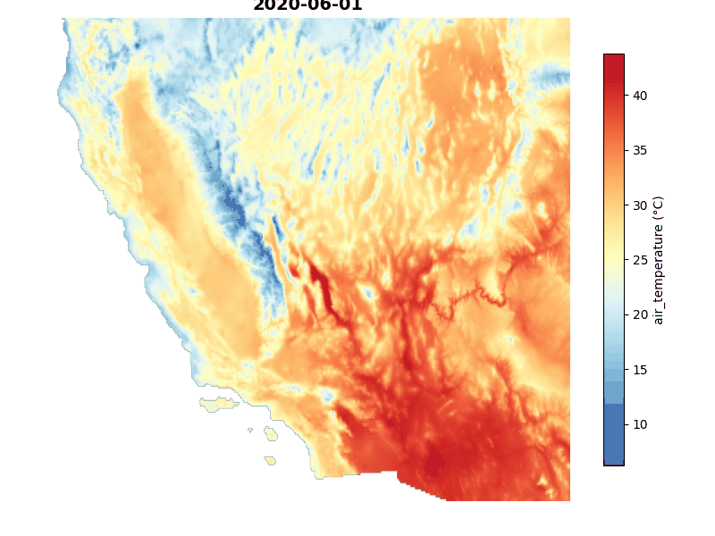
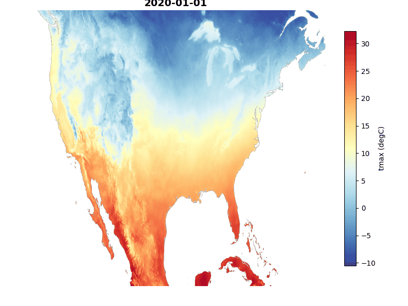

# Planetary Computer MCP Server

A Python implementation of the Planetary Computer MCP server, providing unified access to satellite and geospatial data through natural language queries.

## Sample Outputs

<table>
<tr>
<td align="center"><br><sub><b>Sentinel-2</b><br>Alps</sub></td>
<td align="center"><br><sub><b>Sentinel-2</b><br>Miami</sub></td>
<td align="center"><br><sub><b>NAIP</b><br>Seattle</sub></td>
<td align="center"><br><sub><b>NAIP</b><br>Los Angeles</sub></td>
</tr>
<tr>
<td align="center"><br><sub><b>HLS L30</b><br>Los Angeles</sub></td>
<td align="center"><br><sub><b>MODIS</b><br>Bay Area</sub></td>
<td align="center"><br><sub><b>Sentinel-1 SAR</b><br>Miami</sub></td>
<td align="center"><br><sub><b>Copernicus DEM</b><br>Miami</sub></td>
</tr>
<tr>
<td align="center"><br><sub><b>ESA WorldCover</b><br>Alps</sub></td>
<td align="center"><br><sub><b>IO LULC</b><br>Iowa</sub></td>
<td align="center"><br><sub><b>MS Buildings</b><br>Vector Data</sub></td>
<td align="center"><br><sub><b>TerraClimate PET</b><br>Zarr Preview</sub></td>
</tr>
</table>

<table>
<tr>
<td align="center"><br><sub><b>GridMET Climate Data</b><br>Heatmap Animation</sub></td>
<td align="center"><br><sub><b>TerraClimate Data</b><br>Heatmap Animation</sub></td>
</tr>
</table>

## Features

- **Unified Interface**: Single `download_data` tool that automatically detects datasets from natural language queries
- **Natural Language Geocoding**: Automatically converts place names (e.g., "San Francisco", "the Alps", "Amazon rainforest") to geospatial bounding box coordinates using the Nominatim geocoding service—no need to manually specify coordinates
- **Multi-format Support**: Raster (GeoTIFF), Vector (GeoParquet), and Zarr data
- **Automatic Visualization**: Generate RGB/JPEG previews for LLM analysis
- **Fast Downloads**: Uses odc-stac for efficient COG access

## Installation

```bash
uv sync
```

## Usage

### As MCP Server

```bash
python -m planetary_computer_mcp.server
```

### Direct API Usage

```python
from planetary_computer_mcp.tools.download_data import download_data

# Download Sentinel-2 data for San Francisco
result = download_data(
    query="sentinel-2 imagery",
    aoi="San Francisco",
    time_range="2024-01-01/2024-01-31"
)

print(f"Raw data: {result['raw']}")
print(f"Visualization: {result['visualization']}")
```

## Tools

### download_data

Unified tool for raster, DEM, land cover, and climate data.

**Parameters:**

- `query`: Natural language query (e.g., "sentinel-2", "elevation data")
- `aoi`: Bounding box [W,S,E,N] or place name
- `time_range`: ISO8601 datetime range
- `max_cloud_cover`: Maximum cloud cover (optical data)

**Returns:**

- Raw GeoTIFF/Zarr/Parquet file
- RGB/JPEG visualization
- Metadata

### download_geometries

Tool for vector/building data.

**Parameters:**

- `collection`: Collection ID (e.g., "ms-buildings")
- `aoi`: Bounding box or place name
- `limit`: Maximum features

**Returns:**

- GeoParquet file
- Map visualization
- Feature count

## Supported Datasets

See [collections.md](collections.md) for the complete list of supported datasets.

## Development

### Setup

```bash
uv sync --dev
```

### Testing

```bash
uv run pytest
```

### Linting/Formatting

```bash
uv run pre-commit run --all-files
```

## Architecture

```bash
src/
├── core/           # Core utilities
│   ├── stac_client.py    # STAC search wrapper
│   ├── geocoding.py      # Place name → bbox
│   ├── collections.py    # Dataset metadata
│   ├── raster_utils.py   # odc-stac helpers
│   ├── vector_utils.py   # DuckDB helpers
│   ├── visualization.py  # Matplotlib viz
│   └── zarr_utils.py     # Xarray Zarr helpers
├── tools/          # MCP tools
│   ├── download_data.py
│   └── download_geometries.py
└── server.py       # MCP server entry point
```

## License

Apache 2.0 License
