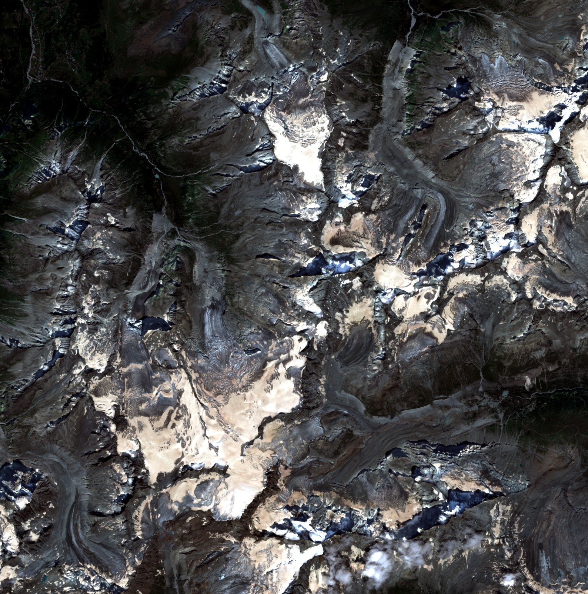
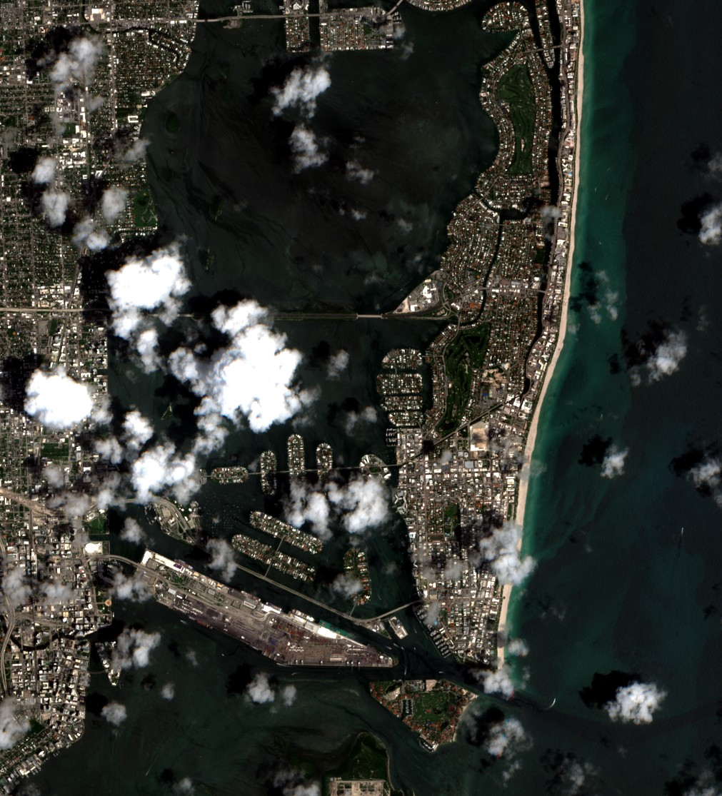
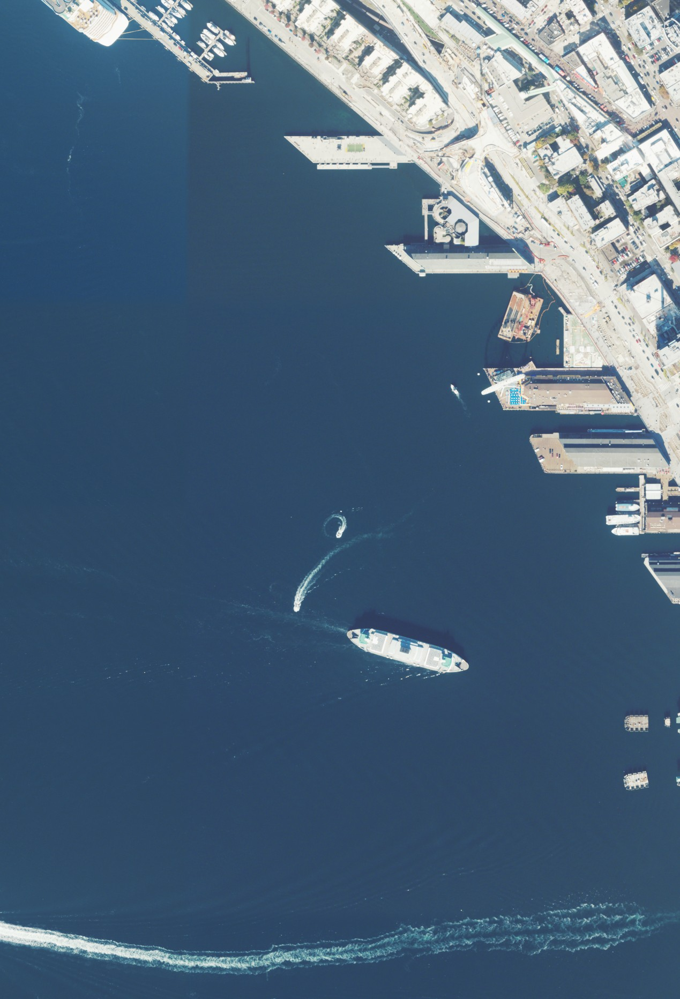
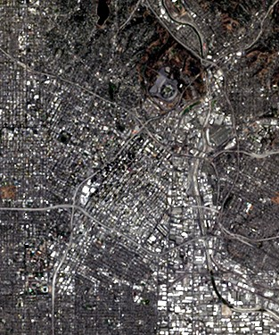
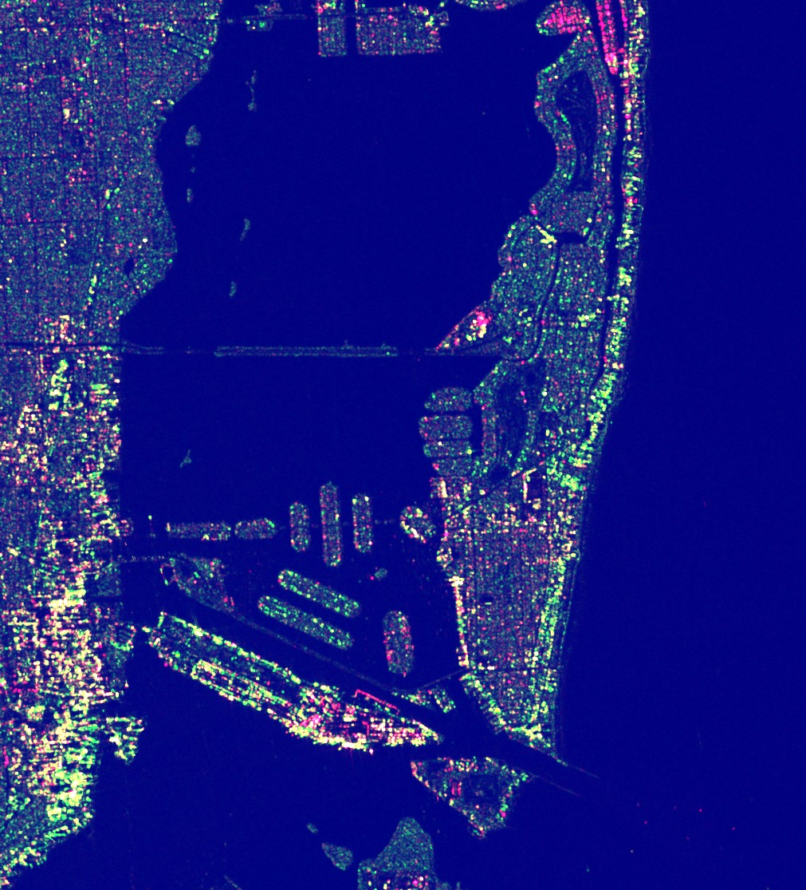
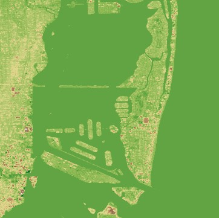
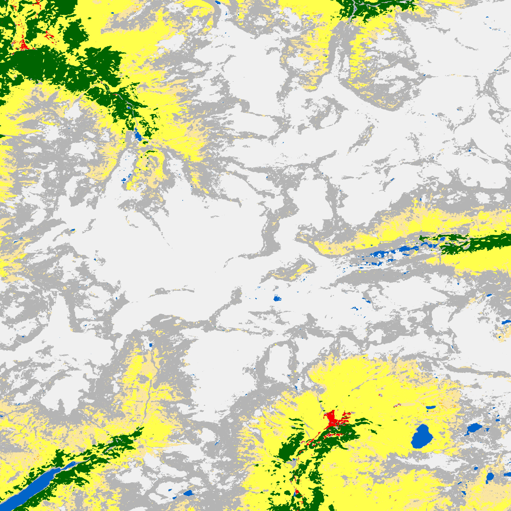
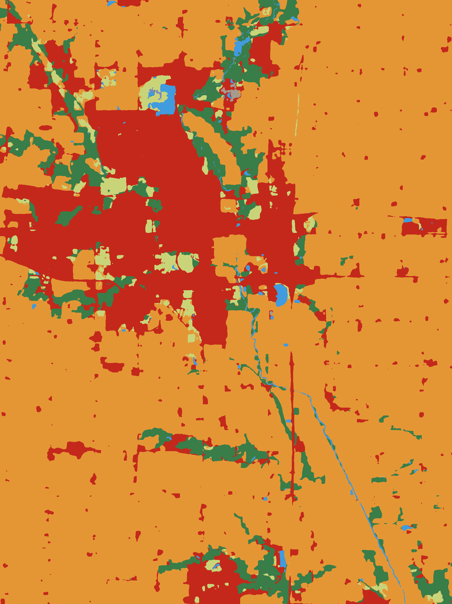
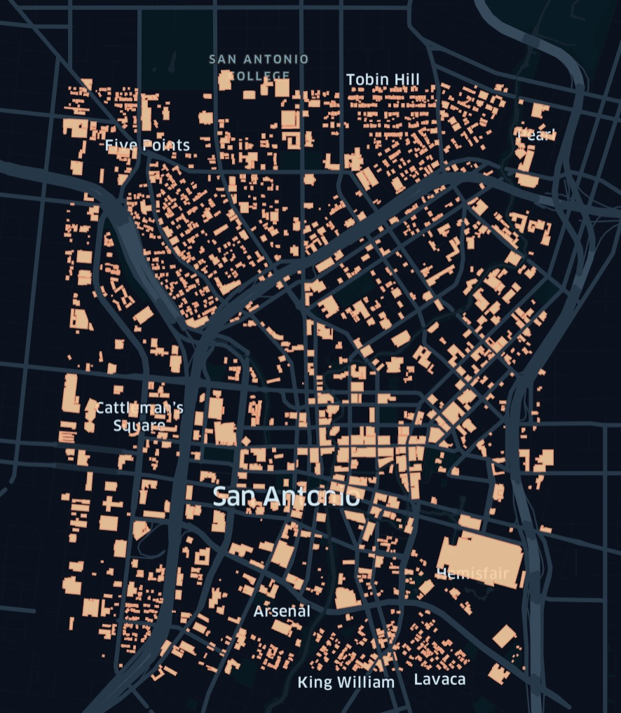

# 🌍 planetary-computer-mcp

> **Access petabytes of Earth observation data through natural conversation.**

A Model Context Protocol (MCP) server that connects AI assistants to the [Microsoft Planetary Computer](https://planetarycomputer.microsoft.com/) — unlocking satellite imagery, climate data, land cover maps, and more. Query Sentinel-2, Landsat, NAIP aerial imagery, global DEMs, and 120+ geospatial datasets using simple spatial and temporal filters.

## Sample Outputs

<table>
<tr>
<td align="center"><br><sub><b>Sentinel-2</b><br>Alps</sub></td>
<td align="center"><br><sub><b>Sentinel-2</b><br>Miami</sub></td>
<td align="center"><br><sub><b>NAIP</b><br>Seattle</sub></td>
<td align="center"><br><sub><b>NAIP</b><br>Los Angeles</sub></td>
</tr>
<tr>
<td align="center"><br><sub><b>HLS L30</b><br>Los Angeles</sub></td>
<td align="center"><br><sub><b>MODIS</b><br>Bay Area</sub></td>
<td align="center"><br><sub><b>Sentinel-1 SAR</b><br>Miami</sub></td>
<td align="center"><br><sub><b>Copernicus DEM</b><br>Miami</sub></td>
</tr>
<tr>
<td align="center"><br><sub><b>ESA WorldCover</b><br>Alps</sub></td>
<td align="center"><br><sub><b>IO LULC</b><br>Iowa</sub></td>
<td align="center"><br><sub><b>MS Buildings</b><br>Vector Data</sub></td>
<td align="center"><br><sub><b>TerraClimate PET</b><br>Zarr Preview</sub></td>
</tr>
</table>

## Install

```bash
npm install -g planetary-computer-mcp

# or locally
npx planetary-computer-mcp
bunx planetary-computer-mcp
```

## Usage

### Tools

- **`search_stac`**: Query STAC catalog by collection, bbox, datetime, limit
- **`get_collections`**: List all collections or get detailed info for a specific collection (assets, bands, resolutions)
- **`describe_collection`**: Get structured metadata with RGB/DEM/SAR strategy and recommended tools
- **`download_asset`**: Download GeoTIFF/assets with auto URL signing
- **`download_visual`**: Download RGB images with smart rendering (JPG for optical/DEM, PNG for classified)
- **`download_multispectral`**: Download specific bands into multi-band GeoTIFF
- **`download_geometries`**: Download vector data (e.g., MS Buildings) with spatial filtering
- **`download_zarr`**: Download spatial/temporal slices from Zarr collections (Daymet, ERA5, TerraClimate)
- **`render_zarr_preview`**: Create heatmap PNG previews from downloaded Zarr data

**Supported Collections:**

- Optical: sentinel-2-l2a, naip, landsat-c2-l2, hls2-l30/s30
- DEM: cop-dem-glo-30, alos-dem
- Land Cover: esa-worldcover, io-lulc-annual-v02, mtbs
- SAR: sentinel-1-rtc
- Vector: ms-buildings
- Climate/Weather: daymet-daily-na, daymet-daily-hi, daymet-daily-pr, era5-pds, terraclimate

## Examples

- **Search Sentinel-2**: `search_stac(collection="sentinel-2-l2a", bbox=[-122.5,47,-122,47.5], datetime="2024-06-01/2024-06-30")`
- **Visual Download**: `download_visual(collection="sentinel-2-l2a", bbox=[-122.4,47.6,-122.3,47.7], datetime="2024-06-01/2024-06-30")`
- **Multispectral**: `download_multispectral(collection="sentinel-2-l2a", assets=["B04","B08"], bbox=..., datetime=...)`
- **Buildings**: `download_geometries(collection="ms-buildings", bbox=[-122.35,47.6,-122.32,47.62])`
- **Climate Data**: `download_zarr(collection="daymet-daily-na", assets=["tmax","tmin"], bbox=[-122.5,47,-122,47.5], datetime="2024-01-01/2024-01-31")`
- **Zarr Preview**: `render_zarr_preview(zarr_path="path/to/daymet_daily_na/tmax")`

## MCP Integration

Add to client config:

```json
{
  "mcpServers": {
    "planetary-computer": {
      "command": "npx",
      "args": ["-y", "planetary-computer-mcp"]
    }
  }
}
```

## Architecture

- **Language**: TypeScript on Node.js ≥18
- **Framework**: MCP SDK with stdio transport
- **API**: Planetary Computer STAC catalog
- **DuckDB**: Spatial queries on parquet
- **Features**: Auto URL signing, streaming downloads, collection caching

## Development

```bash
bun install               # Install deps
bun run build             # Compile to dist/
bun run format            # Format code
bun run check             # Typecheck, lint, prettier, tests
bun run test:integration  # Run all integration tests
bun run mcp               # Start MCP server
```
